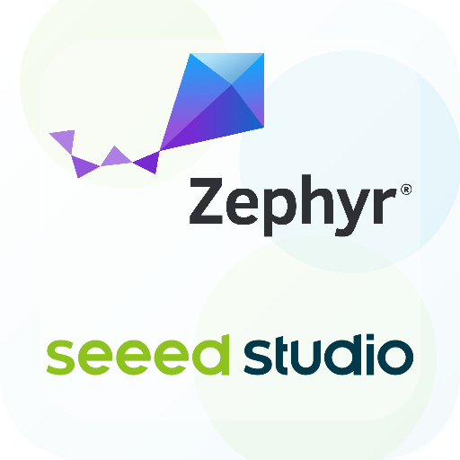

<div align="center">



# Seeed Zephyr Base

**The XIAO + Grove example library, capability catalog, and command-line workflow for [Zephyr RTOS](https://www.zephyrproject.org/).**

Discover what a Seeed Studio XIAO board can build on Zephyr, see which examples are verified, and go from a fresh checkout to flashing firmware with a single command.

[](https://github.com/limengdu/Seeed-Zephyr-Project/actions/workflows/metadata.yml)
[](https://docs.zephyrproject.org/4.4.0/)
[](#supported-boards)
[](#quick-start)

[Quick Start](#quick-start) · [Supported Boards](#supported-boards) · [CLI](#command-line-workflow) · [Documentation](#documentation) · [Roadmap](#roadmap)

**English** · [简体中文](README.zh-CN.md)

</div>

---

## Overview

XIAO is a multi-chip ecosystem. Different XIAO boards use different silicon vendors, wireless stacks, SDKs, flashing tools, and development workflows. Zephyr is becoming the shared technical base across these boards — and this repository adds the XIAO + Grove product experience on top of it.

Upstream Zephyr answers one question: *"Can this board run Zephyr?"*

**Seeed Zephyr Base answers the next ones:**

> What can a XIAO + Grove user actually build on Zephyr? Which examples are verified on real hardware? And how do I build and flash one without first learning Devicetree, Kconfig, and `west`?

You get the smallest verified example for each supported board, board and Grove capability metadata, a build matrix that proves what compiles, and a thin `seeed-zephyr` CLI that picks the right board target and example for you — then hands the real work to standard Zephyr tooling.

## Highlights

- **🧩 One example per board** — minimal, buildable demos for every tracked XIAO board, ready to flash.
- **🔌 One Grove example, every board** — Grove module examples are board-agnostic; a single source tree builds on all XIAO boards via the `seeed_xiao_connector` abstraction.
- **⚡ Single-command workflow** — `seeed-zephyr build | flash | monitor | debug <board>` works from any directory after setup.
- **🔌 Auto board handling** — UF2 mode entry, DFU, PyOCD, and 1200-baud bootloader requests are handled per board, so you don't memorize each vendor's flash dance.
- **📇 Capability catalog** — structured metadata for XIAO boards, Grove modules, and expansion boards.
- **✅ Honest validation** — every board ships with a build-matrix result, and hardware-tested boards are marked as such.
- **🌍 Bilingual docs** — getting-started guides and board notes in English and 中文.
- **🤖 Thin by design** — the CLI is a repository knowledge layer; firmware build, flash, monitor, and debug always run through Zephyr `west` and vendor tools.

## Supported Boards

Status is taken from the [board build matrix](tools/build_matrix/results.md) against the Zephyr **v4.4.0** baseline.

| Board | Vendor | Zephyr target | Example | Status |
| --- | --- | --- | --- | --- |
| XIAO SAMD21 | Microchip | `seeeduino_xiao` | `blinky` | 🔵 Hardware-tested |
| XIAO nRF52840 | Nordic | `xiao_ble` | `blinky` | 🔵 Hardware-tested |
| XIAO nRF54L15 | Nordic | `xiao_nrf54l15/nrf54l15/cpuapp` | `blinky` | 🔵 Hardware-tested |
| XIAO MG24 | Silabs | `xiao_mg24` | `blinky` | 🔵 Hardware-tested |
| XIAO RP2040 | Raspberry Pi | `xiao_rp2040` | `blinky` | 🔵 Hardware-tested |
| XIAO RP2350 | Raspberry Pi | `xiao_rp2350/rp2350a/m33` | `blinky` | 🔵 Hardware-tested |
| XIAO ESP32-C6 | Espressif | `xiao_esp32c6/esp32c6/hpcore` | `blinky` | 🔵 Hardware-tested |
| XIAO ESP32-S3 | Espressif | `xiao_esp32s3/esp32s3/procpu` | `blinky` | 🔵 Hardware-tested |
| XIAO ESP32-C3 | Espressif | `xiao_esp32c3` | `hello_world` | 🔵 Hardware-tested · no on-board LED |
| XIAO RA4M1 | Renesas | `xiao_ra4m1` | `blinky` | 🔵 Hardware-tested · USB DFU |
| XIAO ESP32-C5 | Espressif | `xiao_esp32c5` | `hello_world` | ⛔ No target in v4.4.0 |

**Legend** — 🔵 verified on real hardware · 🟢 builds cleanly in CI · ⛔ tracked, but the selected Zephyr baseline provides no board target yet.

Board-specific flashing, reset, and bootloader behavior is documented in [board notes](docs/en/boards/README.md).

## Quick Start

You don't need to clone this repository to use the tools — install everything from published channels.

> **Where things live:** the `seeed-zephyr` CLI is installed on your `PATH`, and the Zephyr source tree, SDK, and `west` workspace live in `~/zephyrproject`. The installer prepares both for you.

### 1. Install the CLI and Zephyr environment

The one-line installer sets up the `seeed-zephyr` CLI **and** the full Zephyr toolchain (SDK, `west` workspace, and per-board flash tools). It runs on macOS and Linux (use it inside WSL2 on Windows):

```sh
curl -fsSL https://raw.githubusercontent.com/limengdu/Seeed-Zephyr-Project/main/install.sh | bash
```

Set up a single board by passing `--board` through the pipe:

```sh
curl -fsSL https://raw.githubusercontent.com/limengdu/Seeed-Zephyr-Project/main/install.sh | bash -s -- --board xiao_esp32c6
```

Prefer to install just the CLI? Use PyPI, [pipx](https://pipx.pypa.io/), or [Homebrew](https://brew.sh/), then set up the Zephyr toolchain from the [Getting Started guide](docs/en/getting-started.md#2b-zephyr-environment-setup):

```sh
pip install seeed-zephyr                        # all platforms
pipx install seeed-zephyr
brew install limengdu/seeed/seeed-zephyr        # macOS / Linux
```

Keep the CLI, bundled examples, and metadata current with one command:

```sh
seeed-zephyr update
```

Bootstrap older installations to this update flow with the original install channel once:

```sh
brew update && brew upgrade seeed-zephyr
python3 -m pip install --upgrade seeed-zephyr
pipx upgrade seeed-zephyr
curl -fsSL https://raw.githubusercontent.com/limengdu/Seeed-Zephyr-Project/main/install.sh | bash
```

Show the active CLI version, install source, repository commit, and Zephyr baseline:

```sh
seeed-zephyr info
```

On Windows without WSL2, follow the PowerShell setup in the [Getting Started guide](docs/en/getting-started.md).

### 2. Install the editor extension

The **Seeed XIAO Zephyr Assistant** adds a catalog, project generator, and run controls to the editor. Install it from the Extensions view of Cursor, Windsurf, VSCodium, Gitpod, or Eclipse Theia — search **Seeed XIAO Zephyr** — or from the [Open VSX listing](https://open-vsx.org/extension/seeed-studio/seeed-xiao-zephyr-assistant).

On first use, the Catalog view offers setup actions for CLI detection, extension-managed CLI installation, CLI version selection, manual CLI path selection, and repository folder selection. After setup, the same actions stay available from the Catalog title bar.

Use **Update Repository** in the Catalog title bar to refresh the examples and metadata read by the extension.

### 3. Build your first example

Run the CLI from any directory:

```sh
seeed-zephyr build xiao_esp32c6
```

The CLI reads the board metadata, finds the matching example, and calls Zephyr's `west build` with the validated target.

### Uninstall

Remove the `seeed-zephyr` command and, if you choose, the Zephyr workspace and SDK:

```sh
bash uninstall.sh
```

It removes the `seeed-zephyr` CLI symlink, then asks before removing the Zephyr workspace (`~/zephyrproject`) and SDK. Shared build tools installed with Homebrew or your Linux package manager are listed with removal commands rather than removed for you. Add `--yes` to remove the workspace and SDK without prompting, or `--dry-run` to preview.

## Command-Line Workflow

`seeed-zephyr` chooses the board, example, and validated metadata, then delegates the actual device work to Zephyr tooling.

### Build, flash, monitor, debug

```sh
seeed-zephyr build   xiao_esp32c6
seeed-zephyr flash   xiao_esp32c6
seeed-zephyr monitor xiao_esp32c6
seeed-zephyr debug   xiao_esp32c6
```

Flash, then jump straight into the serial monitor:

```sh
seeed-zephyr flash xiao_esp32c6 --monitor
```

### Choose an example

When a board has more than one example, the CLI lists them and lets you pick. Name the example to skip the prompt:

```sh
seeed-zephyr build xiao_esp32c6 blinky
```

### Build a Grove example on any board

Grove module examples live under `examples/grove/` and are board-agnostic: one source tree
builds for every XIAO board through the upstream `seeed_xiao_connector` abstraction. Pass
the board, then the Grove reference:

```sh
seeed-zephyr build xiao_esp32c6  grove/grove_scd41_co2_temperature_humidity_sensor/basic_read
seeed-zephyr build xiao_nrf52840 grove/grove_scd41_co2_temperature_humidity_sensor/basic_read   # same source, another board
```

Inspect the per-pin state exported for editor tooling:

```sh
seeed-zephyr show pins xiao_esp32c6 grove/grove_scd41_co2_temperature_humidity_sensor/basic_read --json
```

Generate a standalone project from a Grove example on any supported board, baking an
optional `--pin` choice into a per-board overlay:

```sh
seeed-zephyr create --from grove/grove_scd41_co2_temperature_humidity_sensor/basic_read \
                    --board xiao_nrf52840 --output ./my-scd41
```

### Build an external application

Point the CLI at any Zephyr app folder (one with `CMakeLists.txt` and `prj.conf`):

```sh
seeed-zephyr flash xiao_esp32c6 --app ~/my-zephyr-app --monitor
```

### Discover what's available

```sh
seeed-zephyr list boards
seeed-zephyr list examples
seeed-zephyr list ports --json
```

### Update

```sh
seeed-zephyr update
seeed-zephyr update --version 0.3.0
seeed-zephyr info
```

This refreshes the current CLI installation or the local repository checkout that supplies examples and metadata. Use `--version` to select a published CLI package version, or a Git tag/commit when running from a repository checkout.

For older installed CLIs that predate `seeed-zephyr update`, run the matching installer channel once:

```sh
brew update && brew upgrade seeed-zephyr          # Homebrew
python3 -m pip install --upgrade seeed-zephyr     # pip
pipx upgrade seeed-zephyr                         # pipx
curl -fsSL https://raw.githubusercontent.com/limengdu/Seeed-Zephyr-Project/main/install.sh | bash
```

After that bootstrap step, use `seeed-zephyr update` for normal updates.

### Serial monitor, no board required

Interactive port and baud-rate selection:

```sh
seeed-zephyr monitor
```

### Maintainer commands

```sh
seeed-zephyr matrix                     # rebuild the full board build matrix
seeed-zephyr verify-hardware xiao_esp32c6  # record a hardware observation
```

For the complete walk-through, see the [Getting Started guide](docs/en/getting-started.md).

## Grove & Expansion Support

The capability catalog also tracks the Grove modules and expansion boards that pair with XIAO, including their interface, default address, power rail, and the Zephyr driver and Kconfig options they need.

Grove module examples are **board-agnostic**: one source tree under `examples/grove/` builds for every XIAO board through the upstream `seeed_xiao_connector` abstraction. The SCD41 `basic_read` example is verified on ESP32-C6, nRF52840, and RP2040 from a single source; the rest of the board matrix is recorded in [`metadata/status/`](metadata/status/). Use `seeed-zephyr show pins <board> grove/<module>/<demo> --json` to get the per-pin state (selectable / reserved / bus / power). The editor extension reads the same Grove examples and status matrix, so Grove modules expand to their available examples in the catalog.

**Grove modules:** Grove - Ultrasonic Distance Sensor · Grove - Soil Moisture Sensor · Grove - Temperature & Humidity Sensor V2.0 (DHT20) · Grove - CO2 & Temperature & Humidity Sensor (SCD41) · 1.47inch LCD Display Module

**Expansion boards:** Grove Shield for XIAO · XIAO Expansion Board · XIAO Round Display

See [`metadata/`](metadata/) for the full, machine-readable catalog.

## Editor Extension

The [Seeed XIAO Zephyr Assistant](tools/vscode-extension/) is the editor front end for this repository. It reads the same metadata and examples as the CLI, so the sidebar stays aligned with the repository content after **Update Repository**.

### Sidebar Layout

- **Projects** — create a project, open a generated project or Zephyr app, select the target board and serial port, and run Build / Upload / Monitor for the current workspace project.
- **Extension Setup** — check the repository and CLI state, install or select a CLI, select the repository folder, update repository content, and refresh the environment.
- **Catalog** — browse XIAO boards, Grove modules, expansion boards, validation badges, Zephyr targets, example metadata, and Grove example status matrices.
- **Details** — clicking a catalog item opens a side panel with the relevant commands and metadata.

### CLI selection inside the extension

The extension can run with the CLI path that fits your setup:

- **Use Existing CLI** detects a `seeed-zephyr` command already installed on the machine.
- **Install Managed CLI** installs a CLI copy owned by the extension.
- **Select CLI Version** chooses the managed CLI version.
- **Select CLI Path** points the extension at a specific command or script.
- **Select Repository Folder** chooses the checkout that supplies examples and metadata.

The extension calls the selected CLI for project creation, serial port detection, and run actions. When testing the extension from a source checkout, point **Select CLI Path** at `scripts/seeed-zephyr` in the same repository so the editor uses the checkout's current CLI.
Zephyr still performs the firmware build, flash, monitor, and debug operations underneath.

### Common editor workflow

1. Open the Seeed XIAO Zephyr sidebar from the activity bar.
2. Use **Extension Setup** to select or install a CLI and choose the repository folder if it is not auto-detected.
3. Use **Projects** to run **Create Project** or **Open Project**.
4. Browse a board example or Grove example under **Catalog**.
5. Grove examples ask for a target board before generation.
6. Use **Open Project** to open a generated project or Zephyr app example, either in a new window or in the current workspace.
7. Select the project board and serial port from **Projects** or the status bar.
8. Use the status bar actions in the project workspace: **Build Project**, **Upload Project**, and **Monitor Project**.

Generated projects record the source repository path in `.vscode/settings.json`, so the status bar can find the same CLI and metadata context when the project is opened later.

### Updating from the editor

Use **Update Repository** under **Extension Setup** or in the sidebar title bar to pull the latest examples, metadata, status matrices, docs, and plugin-readable catalog data. Use **Refresh Catalog** when the files on disk already changed and you only need the view to reload.

## Build From Source

Working on the examples, metadata, or the CLI itself? Clone the repository and run the setup script directly. This also unlocks the maintainer commands (`matrix`, `verify-hardware`) and the in-repo `scripts/seeed-zephyr` launcher.

```sh
git clone https://github.com/limengdu/Seeed-Zephyr-Project.git
cd Seeed-Zephyr-Project
bash scripts/setup-macos.sh        # or scripts/setup-linux.sh
```

Windows (WSL2):

```powershell
powershell -ExecutionPolicy Bypass -File scripts/setup-windows.ps1
```

Setup prepares the Zephyr workspace, installs the Python venv and `west`, downloads Zephyr v4.4.0 and the SDK, fetches per-board flash tools, and offers to install the `seeed-zephyr` CLI. Pass `--board <target>` to limit board-specific downloads to one board.

## Repository Structure

```text
Seeed-Zephyr-Project/
├── examples/
│   ├── boards/          # Minimal, buildable demo per XIAO board
│   └── grove/           # Board-agnostic Grove module examples (one source, all boards)
├── metadata/            # Board, Grove module, and expansion-board catalog
│   ├── boards/          # Includes per-board reserved_pins, analog_pins, and pin_map
│   ├── grove_modules/
│   ├── expansion_boards/
│   ├── form_factors/    # XIAO 14-pin physical layout (pinout diagram data source)
│   └── status/          # Grove example x board build/hardware status matrix
├── scripts/             # Cross-platform setup + the seeed-zephyr launcher
├── tools/
│   ├── cli/             # seeed-zephyr CLI implementation
│   ├── build_matrix/    # Board matrix (run.sh) + Grove matrix (run_grove.py)
│   ├── pin_map/         # Seeds board pin_map from the upstream connector dtsi
│   └── validate_metadata/  # Metadata schema checks (run in CI)
├── docs/                # User-facing guides and per-board notes (EN + 中文)
└── .github/workflows/   # CI: metadata validation
```

## Roadmap

The project is being built in three layers, each enabling the next.

1. **Examples, metadata & validation base** *(in progress)* — minimal board examples, reusable XIAO + Grove project examples, the capability catalog, the build matrix, CI verification, and selected hardware-in-the-loop tests.
2. **Discovery & generation CLI** *(in progress)* — `seeed-zephyr` discovers boards, examples, Grove modules, and expansion boards (with `--json` output), shows asset details, validates metadata, and generates a project from any example with a reproducible `snapshot.json`. Scenario templates and west / PlatformIO output are next.
3. **VS Code product experience** *(MVP in progress)* — the [Seeed XIAO Zephyr Assistant extension](tools/vscode-extension/) browses boards, Grove modules, Grove examples, and expansion boards with validation badges, previews example details and status matrices, creates a project from board or Grove examples, and offers PlatformIO-style status bar Build / Upload / Monitor actions that delegate execution to Zephyr tooling. Wiring diagrams and deeper official-extension integration are next.

The guiding principle: examples and projects are the product core; metadata, the CLI, generators, and editor tooling exist to make those examples easy to find, build, validate, and extend.

## Documentation

| English | 中文 |
| --- | --- |
| [Getting Started](docs/en/getting-started.md) | [入门指南](docs/zh/getting-started.md) |
| [Board Notes](docs/en/boards/README.md) | [开发板说明](docs/zh/boards/README.md) |

Per-board notes cover flashing, reset, bootloader, and serial specifics for SAMD21, nRF52840, MG24, RA4M1, RP2040, and RP2350.

## Contributing

Contributions of new board examples, Grove modules, project examples, and validation evidence are welcome. Metadata is validated automatically on every push and pull request via the [Metadata Validation workflow](.github/workflows/metadata.yml), so keep new catalog entries schema-valid and back build/hardware status with evidence rather than assumptions.

## Acknowledgements

Built on the [Zephyr Project](https://www.zephyrproject.org/) and the [Seeed Studio XIAO](https://www.seeedstudio.com/xiao-series-page) and [Grove](https://wiki.seeedstudio.com/Grove_System/) ecosystems.
